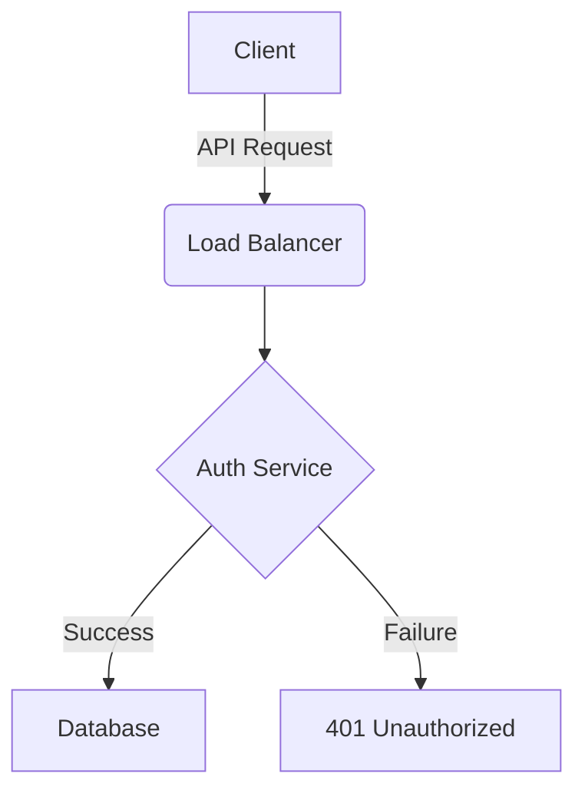

#### Problem:
Organzing a project of any size and providing an easy way to navigate it.

#### Solution:
Create links within the markdown files where the parent points to the children and each child points back to the parent. Basically make a one level deep tree.

---

It's typical that, as a dev, we'll start a project, create a `README.md`, add some basics like how to start the project and then it stops. As the project grows, it wouild be logical that the documentation, in some way, would continue to grow. I would argue that having one large `README.md` isn't great, and separating the docs from the project also annoying, at least to me. Based on what I've seen from various companies, I'd bet most devs don't want to go between the code source and secondary app just to update something.

So instead of having one, oversized file, let's break it down. Let's break the documentation into chapters, topics, modules, or however it makes sense.

Modularization is the process of breaking documentation into discrete, high-cohesion files. This improves maintainability and allows users to self-select the information they need.

A simple tree for documentation could look like this:
```
├── README.md
├── docs
│   ├── setup.md
│   ├── config.md
│   ├── requirements.md
│   ├── diagrams.md
```

#### Things to do:

We want to encourage the user to use the docs, so what's something simple we can do to help there? 
- Have an "Index" doc that links all the docs together. In a markdown file, it's as simple as:

  ```markdown
  <!-- README.md -->
  This is the index for the project.

  - [setup](./docs/setup.md)
  - [config](./docs/config.md)
  - [requirements](./docs/requirements.md)
  - [diagrams](./docs/diagrams.md)
  ```

  ```markdown
  <!-- ./docs/setup.md -->
	[Back to README](../README.md)
	# setup
	1. Do this first
	2. Do this second
	3. Do this third
  ```

1. The "Architecture Decision Record" (ADR)
Documentation often tells you *what* the code does, but rarely *why* a specific path was chosen.
* Use an `docs/adr/` directory to store short, numbered Markdown files (e.g., `0001-use-postgresql.md`).
* When a new engineer asks, "Why aren't we using NoSQL?", you point them to the ADR. This is great for preserving institutional knowledge.

1. Use "Callouts" for Scannability
GitHub, Gitlab, and most documentation engines support Admonitions or Alerts. Use these to highlight critical info without cluttering the text.

> [!NOTE]
> Useful information that users should know.

> [!IMPORTANT]
> Crucial information necessary for users to succeed.

> [!WARNING]
> Critical content demanding immediate user attention to prevent errors.

1. Diagrams as Code (Mermaid.js)
While you can upload `.png` files of architecture diagrams, maintaining them becomes a challenge as they become outdated as the code changes.
* Use **Mermaid.js** syntax directly in your Markdown. GitHub renders this natively.
* You can edit the diagram's logic in plain text. It’s version-controlled, searchable, and easy to update.



Here's a super simple example repo:

[Example Gitlab Project](https://gitlab.com/elijahsamsuels-blog-examples/documentation-linking/)
