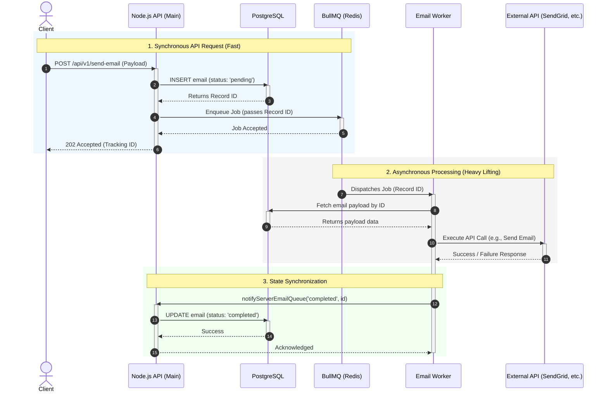

#### Problem:

Imagine you have an API that sends emails or processes ACH payments. If it's just a couple of operations, it's probably not a problem. However, as this scales up—say, to 100 operations taking 100ms each—you're suddenly looking at 10 seconds of blocked application time. Even if you try to fire them off concurrently, you risk hammering your external services, draining your connection pools, and dragging down your overall throughput.

#### Solution:
The "Blind Queue" Pattern
Enter the blind queue. From the client's perspective, this is essentially "fire-and-forget." They hit your endpoint, your server instantly returns a 202 Accepted, and the heavy lifting is pushed to the background. This pattern completely decouples your producers (the API receiving the request) from your consumers (the background workers executing the task), protecting your main application from sudden traffic spikes and slow external dependencies.


#### The Tech Stack
To build this reliably, we are bringing together three core technologies:

- Node.js: Our event-driven runtime to quickly catch and route incoming requests.

- PostgreSQL: The absolute source of truth. We write the initial "pending" state here so no matter what happens to the queue, we have a persistent record of the request.

- BullMQ & Redis: The muscle behind the operation. Redis handles the fast, in-memory job state, while BullMQ provides enterprise-grade queuing features—like retries, exponential backoff, and concurrency management—right out of the box.


#### System Architecture & Data Flow
Before getting into the code, let’s map out how data moves through this system. When building high-concurrency APIs, you need a solid request lifecycle that guarantees you won't drop data if a worker crashes.

Here is the exact flow of a "fire-and-forget" request:

1. The Catch

The client makes a request to the endpoint (e.g., `POST /api/v1/send-email`).

2. The Safety Net (PostgreSQL)

Before we do anything else, we open a database transaction and insert a new record for this request with a status of pending. This is crucial. Redis is fast, but Postgres is our source of truth. If Redis completely falls over, we still know the request happened.

3. The Hand-off (BullMQ/Redis)

We enqueue a new job into BullMQ, passing along the Postgres record ID.

4. The Quick Exit

The Node.js server immediately responds to the client with an HTTP 202 Accepted and the tracking ID. The main thread is now free to handle the next request.

5. The Background Work

Sometime later (usually milliseconds), a BullMQ worker picks up the job from Redis, reads the payload using the Postgres ID, and executes the heavy lifting. Once finished, it signals the main server to update the database record to completed or failed."

#### Diagrams
Everyone loves diagrams!





#### The Producer (Node.js)

In this example, we are using TypeORM, which is why we leverage simplified database abstractions like `.save()` to safely insert the initial state.

```javascript
import { atlasDataSource } from "../database/app-data-source.js";
import { Email } from "atlas-database";
import { addEmailToQueue } from "../utils/producers/emailQueue.js";

const emailRepo = atlasDataSource.getRepository(Email);

export class EmailService {
  static async addEmailRecord({ req, emailData, jobData }) {
    // 1. Validate and assemble the payload
    // ... validation logic ...

    const databaseEmail = {
      to: emailData.to,
      from: emailData.from,
      subject: emailData.subject,
      body: generatedHtmlBody,
      created_by: req.user.id,
    };

    // 2. The Safety Net: Save the 'pending' state to Postgres FIRST
    const savedEmail = await emailRepo.save(databaseEmail);
    return savedEmail;
  }

  static async addEmailToQueue(email) {
    if (!email?.id) return null;

    try {
      // 3. The Hand-off: Pass the DB ID to BullMQ
      const emailQueueRes = await addEmailToQueue(email.id);
      return emailQueueRes;
    } catch (error) {
      console.error("Failed to add to BullMQ:", error);
      throw error;
    }
  }
}
```


#### The Processor (BullMQ/Redis)

Keep the worker architecture modular. We separate the actual business logic (the "Processor") from the queue management and event listeners (the "Worker").

This keeps the code testable and makes it incredibly easy to swap out external providers later.


```javascript
import { EmailService } from "../../services/emailService.js";

export const emailProcessor = async (job) => {
	// We only pass the Postgres ID in the queue to keep Redis memory light
  const id = job?.data; 

  if (!id) {
		throw new Error("emailProcessor missing email id in job.data");
  }

  // The Heavy Lifting: This triggers the external API (SendGrid, SES, etc.)
  const result = await EmailService.sendEmail(id);

  return result;
};

```

#### The Worker & Event Listeners (BullMQ/Redis)

This is the daemon that constantly polls Redis. We cap the concurrency to protect our external APIs from being rate-limited.

Notice how we handle state: instead of the worker directly writing to the database, it triggers a notification payload (notifyServerEmailQueue). This acts as an internal webhook, telling the main server to update the PostgreSQL record to completed or failed.

```javascript
import { Worker } from "bullmq";
import { emailProcessor } from "./processor.js";
import { createRedisConnection } from "../../config/redis.js";
import { notifyServerEmailQueue } from "../../services/notifyServer.js";

// Concurrency Control: Process up to 5 jobs simultaneously 
const opts = {
  connection: createRedisConnection(),
  concurrency: 5, 
};

// Initialize the worker with our dedicated processor
const worker = new Worker("email-queue", emailProcessor, opts);

// --- State Synchronization & Observability ---

worker.on("completed", async (job) => {
  console.log(`[Email Worker] Job ${job.id} completed successfully.`);
  
  // Sync back to the main API server to update Postgres status
  await notifyServerEmailQueue("completed", { 
    email: { id: job.data } 
  });
});

worker.on("failed", async (job, error) => {
  console.error(`[Email Worker] Job ${job.id} failed: ${error.message}`);
  
  // Log the failure state centrally while BullMQ handles the exponential backoff
  await notifyServerEmailQueue("failed", {
    email: { id: job.data },
    error: { message: error.message }
  });
});

worker.on("stalled", async (jobId) => {
  console.warn(`[Email Worker] Job ${jobId} has stalled. Node loop may be blocked.`);
  await notifyServerEmailQueue("stalled", { email: jobId });
});

console.log("🚀 Email BullMQ Worker started. Waiting for jobs...");
```

##### The Architectural Win

By relying on event listeners (`worker.on("completed")`), we completely detach the monitoring and state-syncing logic from the core email execution. If the `EmailService` fails and throws an error, the `processor.js` stops immediately, and the failed event listener catches it to log the telemetry.

This pattern ensures the main API remains fast and highly available, while the background workers safely absorb the chaos of slow or failing external dependencies.

