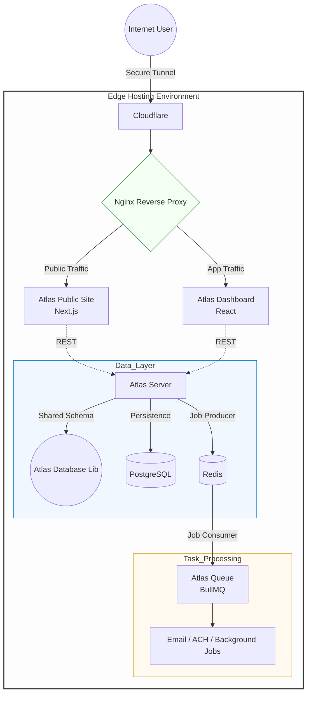

```mermaid

graph TD
    %% External Access
    User((Internet User)) -->|Secure Tunnel| CF[Cloudflare]
    
    subgraph Local_Infrastructure [Edge Hosting Environment]
        %% Reverse Proxy
        CF --> Gateway{Nginx Reverse Proxy}

        %% Domain Routing
        Gateway -->|Public Traffic| FE_Public[Atlas Public Site <br/> Next.js]
        Gateway -->|App Traffic| FE_App[Atlas Dashboard <br/> React]

        %% Internal Service Communication
        FE_Public -.->|REST| BE_Server[Atlas Server]
        FE_App -.->|REST| BE_Server
        
        %% Core Logic and Data
        subgraph Data_Layer
            BE_Server -->|Shared Schema| DB_Lib((Atlas Database Lib))
            BE_Server -->|Persistence| PG[(PostgreSQL)]
            BE_Server -->|Job Producer| Redis[(Redis)]
        end

        %% Asynchronous Worker
        subgraph Task_Processing
            Redis -->|Job Consumer| Queue[Atlas Queue <br/> BullMQ]
            Queue --> Tasks[Email / ACH / Background Jobs]
        end
    end

    %% Styling
    style Local_Infrastructure fill:#fdfdfd,stroke:#333,stroke-width:2px
    style Data_Layer fill:#f0f7ff,stroke:#007acc
    style Task_Processing fill:#fff9f0,stroke:#d4a017
    style Gateway fill:#f2fff2,stroke:#2e7d32
		
		
```